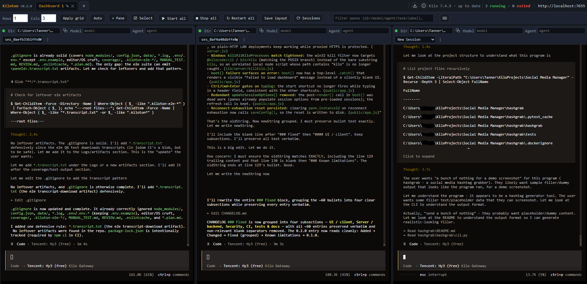

# Kiloton


> Run many **Kilo CLI** agents in one place — a small local dashboard of live
> terminal panes you control from your browser.

Kiloton lets you launch and watch **lots of Kilo coding agents at once**, each in
its own terminal, organized however you like. Start brand-new chats, **reopen an old
chat by its session id**, or run **autonomous tasks** — all side by side.

- Running **6 agents on Kilo's free Gateway**? Open a 2×3 grid and hit *Start all*.
- Running **30 agents** against providers you already pay for? Spread them across
  several dashboards and bring-your-own API keys via environment variables.

No Electron, no native installs beyond Node.js. It is a local web page backed by a
tiny Node server.



---

## Table of contents

- [What you need](#what-you-need)
- [Install & first launch](#install--first-launch)
- [A 2-minute tour](#a-2-minute-tour)
- [Your first agents](#your-first-agents)
  - [Interactive (new chat)](#interactive-new-chat)
  - [Resume an old chat by id](#resume-an-old-chat-by-id)
  - [Task (autonomous)](#task-autonomous)
- [Organizing many agents](#organizing-many-agents)
- [Providers & credentials](#providers--credentials)
- [Configuration reference](#configuration-reference)
- [Docker](#docker)
- [Updating](#updating)
- [Running many agents (practical advice)](#running-many-agents-practical-advice)
- [Troubleshooting](#troubleshooting)
- [Tests](#tests)
- [License](#license)

---

## What you need

| Requirement | Why |
| --- | --- |
| **Node.js 18+** (20/22 recommended) | Runs the dashboard server and spawns Kilo. |
| **The Kilo CLI** (`kilo`) installed | Kiloton drives the `kilo` command you already use. Install once with `npm install -g @kilocode/cli`. |
| **A web browser** | The dashboard is a web page (Chrome, Edge, Firefox, Safari…). |
| **Kilo account / keys (optional)** | The free **Kilo Gateway** works with no key. Bring-your-own keys are optional (see [Providers](#providers--credentials)). |

That's it. On first launch the dashboard opens itself in your browser.

---

## Install & first launch

Don't worry if you've never done this — follow the steps in order. You'll type a
few commands into a terminal (the black window where you already run
`node server.js`).

### 0. Install Node.js (one time)

Kiloton runs on **Node.js**, which also gives you the `npm` command.

1. Go to <https://nodejs.org> and download the **LTS** version.
2. Run the installer and click through with the default options (Windows /
   macOS), or on Linux install it via your package manager, e.g.
   `sudo apt install -y nodejs npm` on Debian/Ubuntu.
3. To confirm it worked, open a terminal and run `node -v` — you should see a
   version number like `v20.x.x`.

Also install the Kilo CLI once (so Kiloton has something to launch):

```bash
npm install -g @kilocode/cli
```

### 1. Put the project files in a folder

- **Easiest:** download the project as a ZIP, unzip it, and remember where the
  folder is (the one containing `server.js`).
- **If you use git:** `git clone https://github.com/puretechteam/kiloton.git`
  then `cd kiloton`.

### 2. Open a terminal *in that folder*

- **Windows:** open the folder in File Explorer, click the address bar, type
  `cmd`, and press Enter. (Or right-click in the folder and choose *Open in
  Terminal*.)
- **macOS:** open the **Terminal** app, type `cd ` (with a space), then drag the
  project folder onto the Terminal window and press Enter.
- **Linux:** open your terminal app and run `cd /path/to/the/folder`.

You'll know you're in the right place if you run `dir` (Windows) or `ls`
(macOS/Linux) and see `server.js` listed.

### 3. Install the dashboard's dependencies (one time)

In that terminal, run:

```bash
npm install
```

This downloads the small set of packages Kiloton needs. It can take a minute the
first time. You only need to do it once (re-run it if you update the files).

> **Linux / macOS — native build tools:** Kiloton's terminal bridge (`node-pty`) ships
> prebuilt binaries for Node 18/20/22, so `npm install` "just works" on those versions.
> On Node 24 (or any version without a matching prebuild) `npm install` must *compile*
> `node-pty`, which needs build tools:
> - **Debian/Ubuntu:** `sudo apt install -y python3 make g++`
> - **macOS:** install Xcode Command Line Tools with `xcode-select --install`
> If the install fails with a `node-gyp` / compilation error, install the tools above
> and re-run `npm install`.

### 4. Start the dashboard

```bash
npm start
```

That's the same as running `node server.js` directly — use whichever you like.
It prints a local address and opens your browser to
<http://localhost:7655>. If the browser doesn't open on its own, just visit that
address yourself.

To **stop** it: click the terminal and press `Ctrl+C`.

> Your layout is saved automatically to `config.json` next to `server.js`, so
> next time you just run `npm start` (or `node server.js`) and you're back where
> you left off.

### Notes

- **Windows** auto-opens with `cmd /c start`; **macOS** with `open`; **Linux**
  with `xdg-open` (needs a desktop environment — on a headless Linux box, start
  with `npm start -- --no-open` and open the URL yourself).
- If you'd rather it not pop a browser: `npm start -- --no-open`, or set
  `KILOTON_NO_OPEN=1`.
- The server listens on `127.0.0.1` (your own machine) by default. Only set
  `KILOTON_HOST=0.0.0.0` to expose it on a trusted local network.

---

## A 2-minute tour

| Region | What it is |
| --- | --- |
| Tabs (top) | Each tab is a dashboard — an independent grid of terminals. `+ Dashboard` adds one; `✕` closes it (and stops its agents). |
| Layout bar | Set `Rows` / `Cols` and `Apply grid` for the active dashboard; `+ Pane` adds a terminal. |
| `☑ Select` | Enter *selection mode*: a checkbox appears on every pane so you can pick several and act on them together (see [Selecting panes](#selecting-panes-bulk-actions)). The button shows a live count, e.g. `☑ Select (3)`. |
| `▶ Start all` / `■ Stop all` / `↻ Restart all` | Launch, stop, or restart every pane in the current dashboard at once — spin up (or recycle) your whole hive with one click. |
| Each pane | One Kilo agent. Status dot: green = running, grey = stopped, red = exited. Controls: mode, dir (with a copy-path button), model, agent, auto, session, task, and Start / Stop / ↻. |

- **Dashboards = tabs.** Each tab is an independent grid of terminals.
- **Each pane = one Kilo agent.** Set its mode, working folder, and options, then
  **Start**. A colored dot shows `running` (green) / `stopped` (grey) / `exited` (red).
- **Empty panes** show a short hint: *"Set a directory / session above, then click Start to launch a Kilo agent here."*
- **Start all / Stop all** launch or stop every pane in the current dashboard at once
  — perfect for spinning up your whole hive with one click.

---

## What's new in 0.2.0

- **Plain copy & paste** -- terminal copy now uses a silent path (no clipboard/notification popups); text is copied only on an explicit Copy / Ctrl+Shift+C / copy-dir, not on every selection.
- **Terminal mouse** -- xterm is configured so mouse-tracking apps (vim/`less`/ncurses) receive events, and the right-click menu now dismisses reliably (click-away, `Esc`, blur/scroll/resize).
- **Duplicate pane** -- clone a pane's mode/dir/model/agent/task/label from its hamburger (☰) menu.
- **Per-pane label** -- a free-text note shown in the header (also persisted in `config.json`).
- **Filter** -- a box in the layout bar finds panes by dir/model/agent/task/label/session id across dashboards.
- **Recent-directories autocomplete** -- the per-pane `Dir` field remembers every directory you type (deduped) in a shared datalist, so a repeated project path is a one-click fill instead of copy/paste.
- **Exit notifications** -- when an agent exits, the tab title flashes, a short beep plays, and (if already permitted) a system notification fires.
- **Health summary** -- the top bar shows `N running · M exited` across all dashboards.
- **Shortcut help** -- a `?`/keyboard button (and the `?` key) opens a shortcuts overlay.
- **Resilience** -- start input is validated and clamped, failed starts show an error state instead of a generic 500, the layout is flushed synchronously on start/stop/exit, and the Kilo binary is resolved once at boot.
- **Docker** -- multi-stage build (smaller final image) with `stop_grace_period` so the server can flush `config.json` on shutdown.
- **Tests / CI** -- more unit tests, a headless B1 mouse-wiring test (`npm run test:b1`), and a GitHub Actions CI workflow.
- **Optional token auth (D6)** -- set `KILOTON_TOKEN` and the API + WebSocket require it (via the `Authorization` header or a `?token=` query), so you can safely expose the dashboard on a LAN. Unset = local-only, no auth.
- **Auto-restart crashed agents (Q1)** -- tick "auto-restart" in a pane's ☰ menu and a *crashed* agent (non-zero exit) is restarted automatically with exponential backoff (up to 5 tries). A clean finish or a manual Stop is left alone.
- **Export / copy transcript (Q6)** -- each pane's ☰ menu can copy or download the pane's *full* terminal output (not just the recent scrollback).
- **Cross-tab sync (Q8)** -- open the dashboard in several browser tabs and they stay in sync live (layout edits, dashboard switches, starts/stops). No config needed.
- **Internal refactor (D2)** -- the server was split into focused `lib/server/*` modules. No behavior change, just easier maintenance.

## Your first agents

### Interactive (new chat)

1. In a pane, leave **Mode** on `Interactive`.
2. Set **dir** to the project folder the agent should work in (e.g. `C:\Projects\myapp`
   or `/workspace/myapp`). If the folder doesn't exist, Kiloton falls back to its own
   folder so nothing breaks.
3. Click **Start**. The terminal fills with Kilo's interface — type your request and
   chat as you normally would.

### Resume an old chat by id

1. Click **⟳ Sessions** in the top bar to refresh the session list (fetched from
   `kilo session list`).
2. Set the pane **Mode** to `Resume`.
3. Pick a session from the dropdown (it shows `session-id — title`).
4. Click **Start**. That exact previous conversation reopens, history included.

> No list? Make sure the dashboard is running where your sessions are stored (your
> machine, or the mounted volume in Docker — see [Docker](#docker)).

### Task (autonomous)

1. Set **Mode** to `Task`.
2. Type a **prompt** (the work you want done).
3. Tick **auto** to let the agent approve its own steps (hands-off).
4. Click **Start**. Kilo runs the task and shows progress live in the pane.

Environment variables for providers are passed straight through to each agent (see
[Providers](#providers--credentials)), so `Task` works with Kilo's Gateway or any
key you've set.

---

## Organizing many agents

- **Rows / Cols + Apply grid** sets the pane layout for the active dashboard.
  Examples: `2 × 3` = 6 terminals; `3 × 2` = 6; `2 × 4` = 8.
- **+ Dashboard** adds a tab; close a tab with the **✕** (stops its agents).
- **+ Pane** adds a terminal to the current dashboard; **Apply grid** reflows them.
- **▶ Start all** starts every pane in the tab — the easiest way to launch your hive.
- **☑ Select** turns on *selection mode* so you can act on a handful of panes at
  once (start / stop / restart / delete). See below.
- Everything is **saved automatically** to `config.json` and restored next time.

### Selecting panes (bulk actions)

Sometimes you don't want *all* panes — just three to delete, or two to refresh.
That's what **selection mode** is for (like selecting photos in a gallery):

1. Click **☑ Select** in the layout bar. A checkbox appears at the left of every
   pane header, and a floating action bar slides up at the bottom of the screen.
2. Tick the panes you want. Selected panes get an amber outline. **Shift-click**
   a second checkbox to select the whole range between two panes at once.
3. Use the action bar:
   - **Select all** / **Clear** — grab every pane, or empty the selection.
   - **▶ Start** / **■ Stop** / **↻ Restart** — run that action on just the
     checked panes.
   - **✕ Delete** — remove the checked panes (stops each agent and discards its
     scrollback). You get one confirm prompt for the whole batch.
   - **Done** — leave selection mode (clears the selection).
4. Press **Esc** (when not typing in a field) to leave selection mode quickly.
   While in selection mode, **Ctrl/Cmd+A** selects every pane, and the **☑ Select**
   button itself shows a live count (e.g. `☑ Select (3)`). Press **s** (when not
   focused in a field or terminal) any time to toggle selection mode.

Selection is per-dashboard: switching tabs clears it, and panes that disappear
from the layout are dropped from the selection automatically.

### Copy a pane's directory

Each pane's **Dir** field has a small **⧉** button that copies the *resolved*
path to the clipboard (after quote-stripping), and hovering the field shows the
resolved path as a tooltip — handy when you've pasted a quoted "Copy as path"
value and want the clean path back out.

### Auto-restart crashed agents (Q1)

Open a pane's hamburger (☰) menu and tick **auto-restart**. If that agent
*crashes* (exits with a non-zero code), Kiloton restarts it automatically with
exponential backoff — base 2s, doubling each attempt, capped at 60s, up to 5
attempts. A **clean exit** (code 0, e.g. a finished task) and a normal user
**Stop** are *not* restarted. After 5 failed attempts it gives up and the pane
stays stopped (its status shows a note). The toggle is saved per pane in
`config.json` as `panes[].autoRestart` (the backoff counter
`autoRestartAttempts` is managed by the server).

### Export / copy a pane's transcript (Q6)

Each pane's hamburger (☰) menu has **Copy transcript** (copies the pane's *full*
terminal output to the clipboard) and **Download transcript** (saves it as
`<paneId>.transcript.txt`). The full transcript is captured server-side — not
just whatever is in the client's recent scrollback. You can also fetch it
directly with `GET /api/instances/:paneId/transcript` (returns `text/plain`;
`404` if the pane is unknown).

### Cross-tab sync (Q8)

Open the dashboard in more than one browser tab and they stay in sync live:
layout edits, dashboard switches, and starts/stops made in one tab are reflected
immediately in the others. This uses the browser's `BroadcastChannel`, with a
`localStorage` fallback, and needs no configuration.

> **Internal change (D2):** the server was refactored into focused modules under
> `lib/server/` (`state.js`, `routes.js`, `ws.js`, `auth.js`, `autorestart.js`,
> `transcript.js`); `server.js` is now a thin orchestrator. This is internal only
> — there is no change to how you use Kiloton.

Suggested layouts:

| You run… | Try |
| --- | --- |
| ~6 agents (free plan) | One dashboard, `2 × 3` or `3 × 2`, then **Start all**. |
| ~12 agents | Two dashboards of `2 × 3`. |
| ~30 agents | Three+ dashboards (e.g. `2 × 4` each); group by project or purpose. |

---

## Providers & credentials

**Out of the box, nothing to configure.** Kilo's free **Gateway** is used when no key
is set, so `Interactive` / `Resume` / `Task` just work.

To use a provider you already pay for, set its API key as an **environment variable**
before starting Kiloton (or in `docker-compose.yml`). Keys are inherited by every
agent process:

| Variable | Use |
| --- | --- |
| `KILO_API_KEY` | Kilo Gateway / credits |
| `ANTHROPIC_API_KEY` | Anthropic Claude |
| `OPENAI_API_KEY` | OpenAI |
| `GEMINI_API_KEY` / `GOOGLE_API_KEY` | Google Gemini |
| (any provider key `kilo` supports) | Passed through unchanged |

> **Note:** Kiloton's own server variables are *not* inherited by agents. Anything
> starting with `KILOTON_` (and `KILO_BIN_PATH`) is stripped from each agent's
> environment, so an agent never sees the dashboard's port or config path. Your
> provider keys (above) are kept and passed through unchanged.

You can also pin a model per pane with the **model** field (e.g. `anthropic/claude-3-5-sonnet`)
and an **agent** with the agent field. These map to `kilo -m` / `--agent`.

---

## Configuration reference

**Environment variables (server)**

| Variable | Default | Purpose |
| --- | --- | --- |
| `KILOTON_PORT` | `7655` | HTTP/WebSocket port. |
| `KILOTON_HOST` | `127.0.0.1` | Interface to bind (localhost by default). Set `0.0.0.0` to expose on a **trusted** LAN — see the security note below. |
| `KILOTON_CONFIG` | `./config.json` | Path to the saved layout file. |
| `KILO_BIN_PATH` | auto | Explicit path to the `kilo` binary if it isn't resolved automatically. |
| `KILOTON_NO_OPEN` | unset | Set to `1` to disable auto-opening the browser. Also `--no-open`. |
| `KILOTON_NO_ORIGIN_CHECK` | unset | Set to `1` to disable the same-origin guard on the API (only safe behind a reverse proxy that strips `Origin`, or on a fully trusted network). |
| `KILOTON_TOKEN` | unset | When set, required on all `/api` requests and WebSocket upgrades (via the `Authorization` header or `?token=`). Enables safe LAN exposure with `KILOTON_HOST=0.0.0.0`. |

**Security:** Kiloton spawns real `kilo` processes (which can run tasks/commands), so
it binds to `127.0.0.1` by default. Only set `KILOTON_HOST=0.0.0.0` on a trusted
network, and never expose the port to the public internet. For LAN exposure you can
set `KILOTON_TOKEN` to require a shared secret on every API request and WebSocket
upgrade (see the env var table below) — that makes `KILOTON_HOST=0.0.0.0` safe on a
trusted network. With no token set, the API/WebSocket run with no auth, intended for
local use only.

**`config.json`**

| Field | Meaning |
| --- | --- |
| `kiloBin` | `"auto"` (recommended) or a path. |
| `autostart` | If `true`, panes that have an `instanceId` are relaunched when the server starts. |
| `dashboards[]` | Each tab: `id`, `name`, `rows`, `cols`, and `panes[]`. |
| `panes[].mode` | `interactive` / `resume` / `task`. |
| `panes[].dir` | Working folder for the agent. |
| `panes[].model` / `agent` | Optional `-m` / `--agent` overrides. |
| `panes[].auto` | For `task`: pass `--auto` (self-approve). |
| `panes[].sessionId` | For `resume`: the session to reopen. |
| `panes[].task` | For `task`: the prompt. |
| `panes[].autoRestart` | If `true`, Kiloton auto-restarts the agent after a *crash* (non-zero exit) — see [Auto-restart crashed agents](#auto-restart-crashed-agents-q1). A clean exit or a manual Stop is not restarted. |
| `panes[].autoRestartAttempts` | Runtime backoff counter (managed by the server; reset on a successful start). |
| `panes[].instanceId` / `status` / `exitCode` | Runtime state (managed for you). |

**Ops endpoints** (useful for headless / Docker / monitoring):

| Endpoint | Returns |
| --- | --- |
| `GET /api/health` | `{ ok, uptime, runningInstances, kiloVersion }` — process uptime, live pane count, and the installed Kilo CLI version. |
| `GET /api/instances` | `[{ paneId, status, exitCode }]` for every running/stopped instance. |
| `GET /api/instances/:paneId/transcript` | The pane's *full* captured terminal output as `text/plain` (`404` if the pane is unknown) — see [Export / copy a pane's transcript](#export--copy-a-panes-transcript-q6). |
| `GET /api/version` | `{ version }` — the Kiloton dashboard version (matches `package.json`). |

`POST /api/config` validates its body (`dashboards` must be an array of well-formed
dashboards) and returns `400` otherwise; it also kills any orphaned agent whose pane no
longer exists in the saved layout.

---

## Docker

Everything — the dashboard **and** the Kilo agents it spawns — can run inside a
container.

### Build & run

```bash
docker build -t kiloton .
docker run --rm -p 7655:7655 \
  -v "$PWD/workspace:/workspace" \
  -v "$PWD/data:/data" \
  kiloton
```

Open <http://localhost:7655> and set each pane's **dir** to a path under
`/workspace`. The default pane directory is `/workspace`.

The image uses a **multi-stage build**: a `build` stage (with `python3`/`make`/`g++`)
compiles the native `node-pty` module, then the final `runtime` stage is a clean
`node:22-slim` that copies the prebuilt `node_modules` and drops the build
toolchain. This keeps the published layer small and means `node-pty` compiles
once in the build stage instead of pulling build tools into the running image.

### docker compose

```bash
docker compose up --build
```

`docker-compose.yml` mounts `./workspace` (your code) and `./data` (Kiloton's layout,
survives restarts), and includes commented volumes to **share your host Kilo data and
config** so you can resume real host sessions and reuse host auth:

```yaml
# Linux/macOS:
- ${HOME}/.local/share/kilo:/root/.local/share/kilo
- ${HOME}/.config/kilo:/root/.config/kilo
# Windows (PowerShell ${USERPROFILE}):
- ${USERPROFILE}/.local/share/kilo:/root/.local/share/kilo
- ${USERPROFILE}/.config/kilo:/root/.config/kilo
```

Set provider keys in `docker-compose.yml` under `environment:` (e.g. `OPENAI_API_KEY`).

`restart: unless-stopped` brings the container back after a crash, and
`stop_grace_period: 10s` gives the server its `SIGTERM` window to flush
`config.json` (its shutdown handler has a 1s fallback) before Docker sends
`SIGKILL`.

> The container has no browser, so `--no-open` is implied there; connect from your
> host machine's browser at the published port (on macOS / Windows with Docker
> Desktop that's simply <http://localhost:7655> — the published port is mapped to
> your host's localhost automatically).

---

## Access from another network (Tailscale)

Want to run Kiloton on a home computer and open its dashboard from your work
laptop — without opening any ports on your router? **Tailscale** is the easiest
way (no networking knowledge required). It creates a private, encrypted network
(the "tailnet") between your own devices.

1. **Install Tailscale on both machines** — the home computer that runs Kiloton
   and the work machine you'll browse from — from <https://tailscale.com>. Sign
   in to the **same** Tailscale account on each so they're on the same tailnet.

2. **Make Kiloton listen on the network interface Tailscale uses.** By default
   the server binds to `127.0.0.1` (localhost only — see `server.js`,
   `HOST = process.env.KILOTON_HOST || "127.0.0.1"`), so other devices can't
   reach it. Start it with `KILOTON_HOST=0.0.0.0` to bind all interfaces:

   ```bash
   KILOTON_HOST=0.0.0.0 npm start
   ```

   (Docker: `docker run -e KILOTON_HOST=0.0.0.0 -p 7655:7655 …`, or add
   `KILOTON_HOST: "0.0.0.0"` to the `environment:` block in
   `docker-compose.yml`. You can also bind just Tailscale's interface by using
   the machine's Tailscale IP from the Tailscale app instead of `0.0.0.0`.)

3. **Set a token so your dashboard isn't open to every device on your tailnet.**
   With `KILOTON_HOST=0.0.0.0` the dashboard is reachable by any device on your
   tailnet, so set `KILOTON_TOKEN` (a shared secret required on every API
   request and WebSocket upgrade):

   ```bash
   KILOTON_HOST=0.0.0.0 KILOTON_TOKEN=change-me npm start
   ```

   Tailscale itself already **encrypts and authenticates** the connection
   between your two machines, so the link is private end-to-end. The token adds
   a second layer so only people who know it can drive your agents.

4. **Open it from the work machine.** Find the home computer's Tailscale IP in
   the Tailscale app (it looks like `100.x.y.z`), then browse to:

   ```
   http://<home-tailscale-ip>:7655/?token=change-me
   ```

   Visit that URL **once** with `?token=change-me` — Kiloton then sets a cookie,
   and the rest of the UI, API, and WebSocket work without you re-entering it.

> **Caveat:** the server must bind `0.0.0.0` (or the Tailscale IP) to be
> reachable over Tailscale — `127.0.0.1` only works from the same machine. Use
> the home machine's **Tailscale IP** (not its LAN IP) from the work machine,
> since the two are on different networks. Keep `KILOTON_TOKEN` set whenever the
> server is bound to a non-local interface.

---

## Running many agents (practical advice)

- **Group by dashboard.** Separating projects or teams into tabs keeps each grid
  readable and makes *Start all* meaningful per group.
- **Resources.** Each agent is a real `kilo` process. 6 is light; 30 is fine on a
  capable machine but uses more CPU/RAM — size the host accordingly.
- **Shared database.** All agents write to Kilo's global session database
  (`~/.local/share/kilo/kilo.db`). Under very heavy concurrent load you may occasionally
  see a SQLite lock error. If that happens, stagger starts (e.g. use *Start all*, which
  launches sequentially) or split agents across more dashboards. Normal interactive and
  task use is unaffected.

---

## Troubleshooting

| Symptom | Fix |
| --- | --- |
| Browser didn't open | Visit the printed URL manually, or run `npm start -- --no-open` and open it yourself. |
| Pane shows `exited` immediately | The agent process ended (bad session id, auth, or model). Check the terminal output; for `resume`, confirm the id exists via **⟳ Sessions**. |
| "Port in use" | Another Kiloton is running, or set `KILOTON_PORT=7656` (or any free port). |
| Sessions list is empty | The dashboard isn't looking at your sessions — run it on the machine (or mounted volume, in Docker) that holds them. |
| Can't resume a host session in Docker | Mount your host `~/.local/share/kilo` and `~/.config/kilo` as shown above. |
| `kilo` not found | Reinstall the CLI globally (`npm install -g @kilocode/cli`), or set `KILO_BIN_PATH`. |

---

## Updating

**If you downloaded a ZIP** (the easy way): just download the new ZIP, replace
your project folder with the new files, then run `npm install` once and
`npm start` (or `node server.js`) again. Your `config.json` (your saved layout)
is separate and won't be touched, so your panes come back.

**If you used git**: updates are pulled straight from GitHub — no need to dig
through files by hand. Your layout (`config.json`) and `node_modules` are
git-ignored, so a pull never clobbers your setup.

```bash
npm run update      # git pull --ff-only + npm install
```

Then **restart the dashboard** (click the terminal and press `Ctrl+C`, then
`npm start` again) to pick up the new code. Run it whenever you want the latest
changes; it's safe to run often.

> Notes: `npm run update` needs a **git clone** — it runs `git pull`, so it won't
> work from a downloaded ZIP (use the ZIP steps above instead). `git pull
> --ff-only` only applies clean fast-forwards, so as long as you haven't edited
> tracked files it always updates cleanly. If you ever hit a conflict, reset your
> local changes (`git reset --hard`) and pull again — your `config.json` is
> untouched. For scheduled updates you can point a weekly task/scheduler at
> `npm run update`.

---

## Tests

The suite boots the real server and drives the actual `kilo` CLI — no browser or
network required (it proves the agent *process* starts, streams its TUI, and stops;
sending prompts is left to you).

```bash
npm test            # core suite + scaling to 6 agents (your typical case)
npm run test:stress # scales to 30 agents (power-user case)
```

It covers: server boot, asset serving, session listing, interactive/resume/task
lifecycles, restart, invalid inputs, unknown-pane 404s, multiple dashboards, autostart,
environment passthrough (`KILO_BIN_PATH` + provider keys — and that `KILOTON_*` vars are
*not* leaked to agents), model/agent passthrough (`-m` / `--agent`), the `/api/version`
endpoint, malformed-config `400`s, the `/api/health` and `/api/instances` shapes, and
concurrent scaling.

Two faster checks run without booting a server or spawning Kilo:

```bash
npm run lint       # ESLint over server.js, lib, public/app.js, test
npm run test:unit  # pure-function unit tests (cleanDir / buildArgs / normalize /
                   #   validateConfig, plus getKiloBin / getKiloVersion resolution)
npm run test:b1   # headless jsdom test asserting the B1 terminal-mouse wiring
```

Gate a change with `npm run lint && npm run test:unit && npm run test:b1 && npm test`.

**CI:** a GitHub Actions workflow (`.github/workflows/ci.yml`) runs on every push
and pull request across a Node 18/20/22 matrix. It runs `npm ci`, then
`npm audit --audit-level=high`, `npm run lint`, `npm run test:unit`,
`npm run test:b1`, and `npm run test:client-e2e` (headless jsdom suites, no Kilo
needed). The heavier process-booting e2e (`npm test`, which spawns the real
`kilo` CLI via node-pty) is intentionally **not** part of CI — run it locally or
on a schedule to keep the pipeline fast.

---

## License

MIT — see [LICENSE](./LICENSE).
